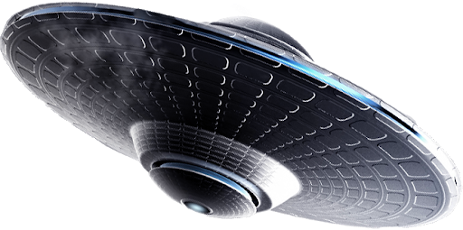

# UFO Sighting Search Enging with JavaScript

---

---

## Contact Information

Rob Savage 

rob.savage@me.com

[LinkedIn](https://www.linkedin.com/in/robsavage/)

[Tableau Public](https://public.tableau.com/profile/rob.savage)

---

## Project Description

The purpose of this project was to use the provided `json` data set (`data.js` and create a basic HTML web page that appends a table to the page that will listen for events and search through the `date/time` column to find rows that match user input.

---

## Tools Used

1. JavaScript

2. HTML

3. Github (Publishing of Results and Analysis)

4. CSS

---

## Steps 

1. Started on the app by assigning the `data.js` to a variable `tableData`

2. Created a reference to the table body `tbody`

3. Called the data to be used throughout the app

4. Began work on the filtering of the page by selecting the `#filter-btn`

5. Created a function for the corresponding filter button that responds when data is entered into the field

6. Began the stylizing for the HTML page 

